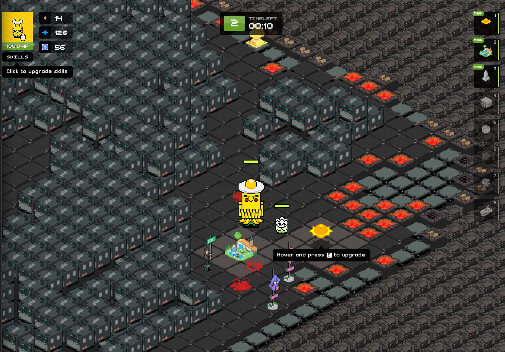

# Crypto Defense 

[gha-badge]: https://github.com/ZaK3939/tower-defense/workflows/ci.yml/badge.svg

## 🏁 OverView

- `crypto-defense` is an experimental game project that leverages the power of phi assets. The game challenges players to survive waves of enemies

## 🧐 Architecture

- Frontend: The game's user interface is built using React/phaser 3, providing a responsive and interactive experience.

- Backend: The backend logic is handled by colyseus, ensuring efficient game mechanics and real-time updates.

## ✍️ Related Link

- [Phi CC0 Assets](https://github.com/PHI-LABS-INC/phi-objects)
- [Phi Quest](https://quest.philand.xyz/)
- [Phi Land](https://land.philand.xyz/)
- [Wawa](https://wawa.philand.xyz/)

## Available Commands

| Command         | Description                                                                       |
| --------------- | --------------------------------------------------------------------------------- |
| `npm install`   | Install project dependencies                                                      |
| `npm run watch` | Build project and open web server running project, watching for changes           |
| `npm run dev`   | Builds project and open web server, but do not watch for changes                  |
| `npm run build` | Builds code bundle with production settings (minification, no source maps, etc..) |

## 🎈 License

This project is licensed under GNU.

## 🎉 Acknowledgements

- [izowave](https://github.com/neki-dev/izowave)
- [phaser3-typescript-project-template](https://github.com/photonstorm/phaser3-typescript-project-template)
- [Bom Bom Panic](https://github.com/recursion-team-v/bomb/)
- [まんぼう探検隊](http://www.manbou2ndclass.net/p/index.html)
